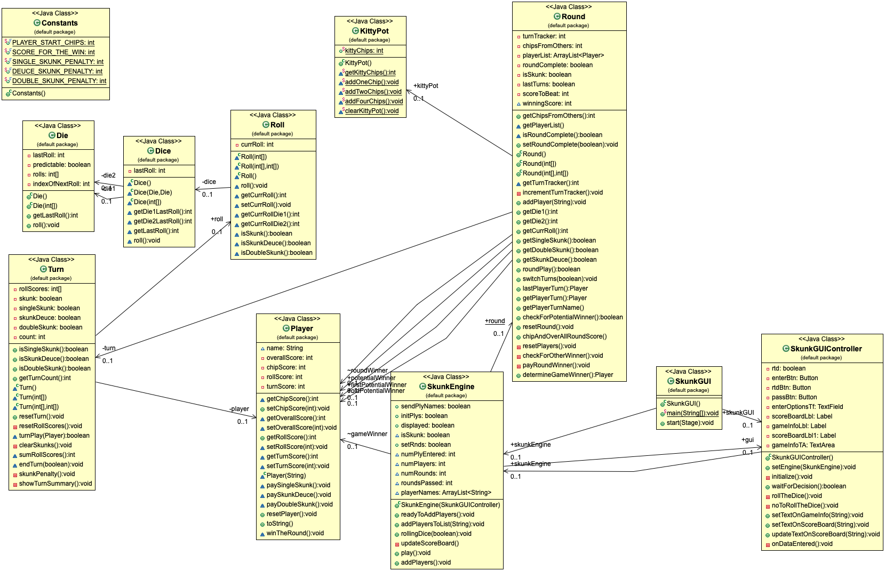

## Group Members(github ID)
    Will Wang(wsl100624), Coco Zhu(zhusyx), Pengxue Her(Soujirou152).

## Test Coverage of non-UI code 
    95% in overall 

## UML (Before)
   

## UML (After)   
    

## Refactoring
     1. Low coupling 
            - With commit ID c429a2e671613ca607c22083e4a727bcff99fb3e
            - Made KittyPot separated from Round class
            - Made KittyPot as a static class and used by all the classes easily
     2. High Cohesion
            - With commit ID faf83d9be8b99c732a538433ebc4a9738eeefbfa
            - Made indivdual class for all the Constants
     3. Extract methods
            - With commit ID 41e7effbcc2b280606f941fab8a5b4f9c795c848
            - showTurnSummary
            - skunkPenalty

## User Manual
 
 JVM Configuration
    There was some trouble trying to build the application if the Standard VM was not set to jdk1.8.0_102.    
    To do this: 
        Find the path to jdk1.8.0_102
        Go to "Preferences" in eclipse
        Expand "Java"
        Go to Installed JREs
        If jdk1.8.0_102 is listed, check the box next to it and apply
        If jdk1.8.0_102 is not listed, click "Add"
        Select "Standard VM" and hit "Next"
        Click "Directory" and go to the path of jdk1.8.0_102
        Select that folder
        Click "Next" and wait for the JRE system libraries to load
        Click "Finish"
        Check the box next to jdk1.8.0_102
        Apply and close
     JavaFX still needs to be included in eclipse as a referenced library before launching the application.

